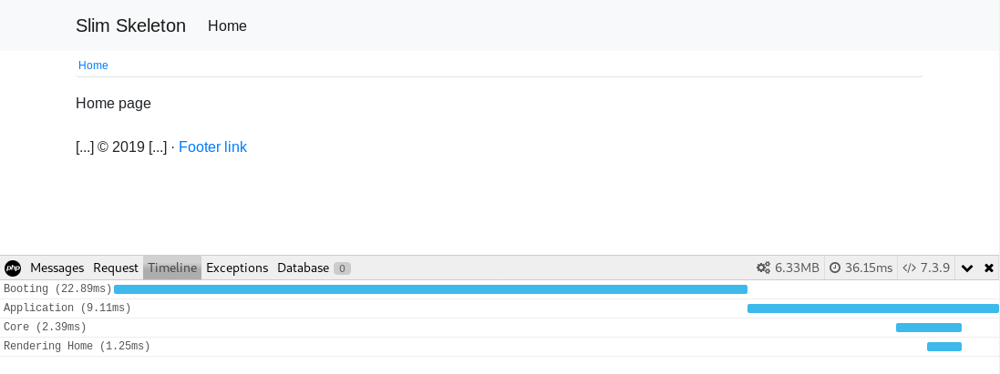

# Slim Framework 4 Skeleton

This is a simple skeleton application that can be used to start working on a new [Slim Framework 4](https://www.slimframework.com) application. This application uses Slim 4 with [Slim-Psr7](https://github.com/slimphp/Slim-Psr7) implementation, [PHP-DI](https://github.com/PHP-DI/PHP-DI) implementation, [Twig](https://github.com/twigphp/Twig) and comes with pre configured [Monolog](https://github.com/Seldaek/monolog), [Twig-View 3](https://github.com/slimphp/Twig-View) (Beta), [Flash](https://github.com/slimphp/Slim-Flash), [Doctrine](https://github.com/doctrine/orm) and [Debugbar](https://github.com/maximebf/php-debugbar).

## Remarks

Debugbar is setup to show booting, application and core times in the timeline view.

The template uses the JavaScript and CSS libraries [JQuery](https://www.jquery.com/), [Bootstrap](https://www.getbootstrap.com/) and [Popper.js](https://popper.js.org/).

## Preview

